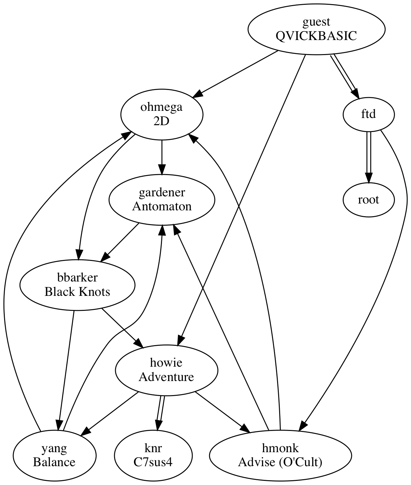

| account | name | password | content | route |
|:--|:--|:--|:--|:--|
| ftd | | falderal90 | icfp.exe | BASIC (hard) |
| knr | | X3.159-1989 | C7sus4 | ADVTR (hard) |
| gardener | Cain Gardener | mathemantica | Antomaton | BALANCE, CIRCS, ADVISE |
| ohmega | Bill Ohmega | bidirectional | 2d (CIRCS) | BASIC (easy), BALANCE, ADVISE |
| yang | Y Yang | U+262F | BALANCE | ADVTR (easy), BALANCE, BLACK |
| howie | Howard Curry | xyzzy | Adventure | BASIC (easy), BLACK |
| hmonk | Harmonious Monk | COMEFROM | ADVISE (O'Cult) | ftd, ADVTR (easy) |
| bbarker | Betty ? | plinko | Black Knots | gardener, CIRCS |
<!-- | assistant-root | | h1dd3n | | | -->
<!-- | associate-root | | @tth3 | | | -->



ADVTR's /etc/passwd:

```
howie:xyzzy:Howard Curry:/home/howie
yang:U+262F:Y Yang:/home/yang
hmonk:COMEFROM:Harmonious Monk:/home/hmonk
```

BALANCE's /etc/passwd:

```
yang:U+262F:/home/yang
gardener:mathemantica:/home/gardener
ohmega:bidirectional:/home/ohmega
```
